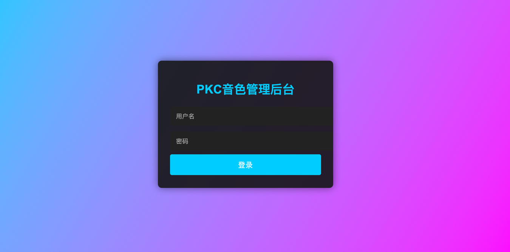

# PKC音色管理后台
仅用于PKC音色维护，用户可自定义音色后台管理，进行音色增删减

##  一、启动项目

## 1. 使用 Python 启动

首先，确保你已安装 Python 和相关依赖项。可以使用 `pip` 安装所需的库：

```bash
pip install -r requirements.txt  
```
然后，使用以下命令启动应用：
```bash
# 进入主目录
cd PKCYsManage
# 启动项目
nohup python3 main.py &
# 查看日志
tail -f nohup.out
```

## 2. 使用 Docker 启动
确保你已安装 Docker。使用以下命令构建镜像并运行容器：  
`PKC_USER=PKC  #用户名，默认pkc（可修改）`   
`PKC_PASSWORD=PKC  #登录密码，默认pkc（可修改）`  
```bash
docker run -d -p 39900:39900 -e PKC_USER=pkc -e PKC_PASSWORD=pkc --name pkc-ys curtinlv/pkc-ys
```

## 3. 使用 Docker Compose 启动（推荐）
确保你已安装 Docker Compose。创建一个 `docker-compose.yml` 文件并填入以下内容：  
`PKC_USER=PKC  #用户名，默认pkc（可修改）`   
`PKC_PASSWORD=PKC  #登录密码，默认pkc（可修改）`  
`PKC_MY=1d5ee08d-96f4-4acf-866e-07adb8781184    # 接口密钥（可修改）`   
```yaml
version: '3.3'

services:
  pkc-ys:
    image: curtinlv/pkc-ys
    container_name: pkc-ys       
    ports:
      - "39900:39900"
    environment:
      - PKC_TITLE=PKC音色管理系统    # 系统名称
      - PKC_USER=pkc             # 用户名
      - PKC_PASSWORD=pkc         # 密码，如需带特殊字符用.env引入
      - PKC_MY=1d5ee08d-96f4-4acf-866e-07adb8781184         # 接口密钥，如需带特殊字符用.env引入
    volumes:
      - ./backup:/app/backup          # 音色备份目录
      - /etc/localtime:/etc/localtime:ro 
    restart: unless-stopped

```
然后，在包含 docker-compose.yml 的目录下运行以下命令启动服务：
```bash
docker-compose up -d
```

## 二、访问地址
音色管理后台访问地址：  
默认登录用户名：pkc  
默认登录密码：pkc
```http request
http://ip:39900
```
音色列表接口地址：
```http request
http://ip:39900/ysList
```

## 三、常用 Docker 命令  
以下是一些常用的 Docker 命令，用于管理容器和查看日志等：
- 查看运行中的容器：
```bash
docker ps 
```
- 更新容器，或修改`docker-compose.yml`配置需执行生效：
```bash
docker up -d  
```
- 查看所有容器（包括停止的）：  
```bash
docker ps -a
```
- 查看容器日志： 
```bash
docker logs -f pkc-ys
```
- 重启容器：
```bash
docker restart pkc-ys
```
- 停止容器：  
```bash
docker stop pkc-ys
```

- 启动已停止的容器：  
```bash
docker start pkc-ys
```
- 删除容器：  
```bash
docker rm pkc-ys
```
